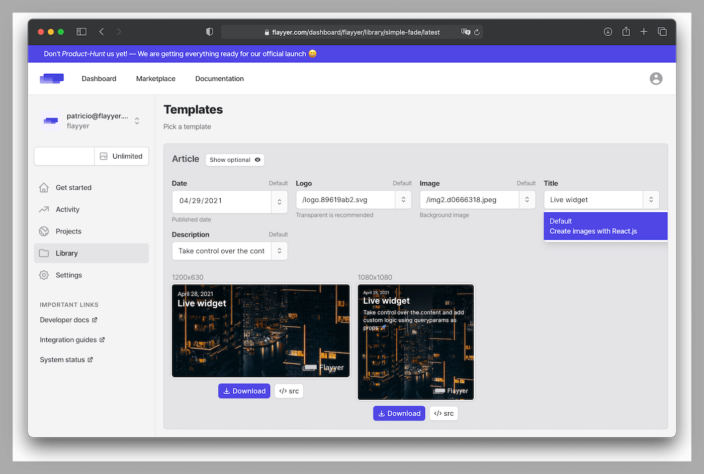

# @flayyer/variables

Helper module to create a `schema` that enables Flayyer to display template's variables on https://flayyer.com for decks and templates.

```sh
yarn add @flayyer/variables
```

Here is what a template with an exported `schema` looks like:



## Usage

```tsx
import { Variable as V, Static, Validator } from "@flayyer/variables";

/**
 * Export `const schema = V.Object({})` to make variables visible on https://flayyer.com/
 */
export const schema = V.Object({
  title: V.String({ description: "Displayed on https://flayyer.com" }),
  description: V.Optional(V.String()),
  image: V.Optional(V.Image({
    description: "Image URL",
    examples: ["https://flayyer.com/logo.png"],
  })),
  font: V.Optional(V.Font({
    default: "Inter", // https://github.com/flayyer/use-googlefonts
  })),
});
const validator = new Validator(schema);

// Remove line and TemplateProps<Variables> if using plain Javascript
type Variables = Static<typeof schema>;

export default function Template({ variables }: TemplateProps<Variables>) {
  if (validator.validate(variables)) {
    const title = variables["title"];
    const description = variables["description"];
    const image = variables["image"];
    // ...
  }
}
```

Credits to https://github.com/sinclairzx81/typebox to enable creating a JSON Schema with an amazing developer experience.
